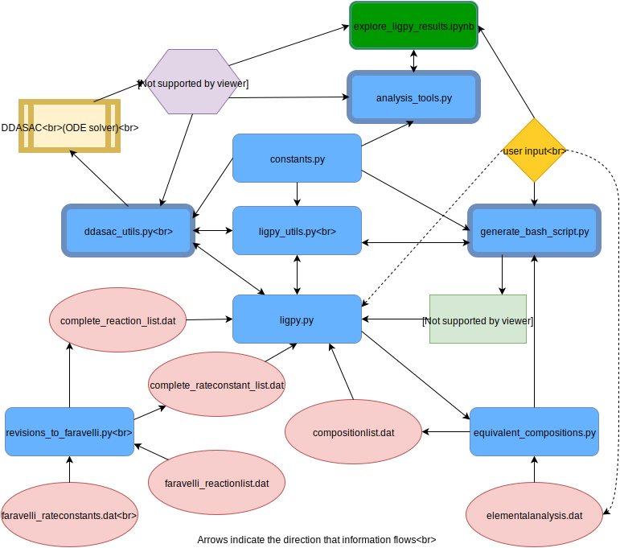

.. ligpy documentation master file, created by
   sphinx-quickstart on Thu May 26 12:21:16 2016.
   You can adapt this file completely to your liking, but it should at least
   contain the root `toctree` directive.

Welcome to ligpy's documentation!
=================================

Introduction
============
Biomass valorization through thermochemical conversion of lignocellulosic
feedstocks is limited by our lack of detailed kinetic models. In addition to
adding mechanistic understanding, more detailed models are needed to optimize
industrial biomass pyrolysis processes for producing fuels and chemicals. To
this end, we developed a kinetic model for lignin pyrolysis involving ~100
species and 400 reactions which is capable of predicting the temporal evolution
of molecules and functional groups during lignin pyrolysis. The model provides
information beyond the lumped yields of common pyrolysis models without any
fitting, allowing it to cover a wider range of feedstocks and reaction
conditions. Good agreement is observed with slow pyrolysis experiments, and an
exhaustive global sensitivity analysis using over two million simulations
sheds light on reactions that contribute most to the variance in model
predictions (sensitivity analysis results and a package to visualize them are
available `here <https://github.com/houghb/savvy>`_). Model predictions for
fast pyrolysis are available, however,
recently developed experimental techniques for kinetically-controlled fast
pyrolysis of biomass have yet to be applied to lignin.

ligpy is the package developed to solve the kinetic model we describe in our
2016 paper, **Detailed kinetic modeling of lignin pyrolysis for process
optimization** (a link to the paper will be added when it is published).

To start using ligpy see the "Installing ligpy" and "Getting started" pages below.

To cite ligpy, follow the badge below:

.. image:: https://zenodo.org/badge/doi/10.5281/zenodo.53202.svg
   :target: http://dx.doi.org/10.5281/zenodo.53202

Contents
=========

.. toctree::
   :maxdepth: 2

   requirements
   getting_started
   module_docstrings

Package Structure
=================
ligpy's architecture is shown below.  Blue rectangles are python modules and red
ovals are data files that describe the kinetic reaction scheme or the
composition of starting lignin species.

Shapes with a thick border (*generate_bash_script, ddasac_utils, DDASAC,* and
*analysis_tools*) refer to pieces of the code that will likely need to be
replaced or modified by users who do not have access to the same computing
environment that we developed this program on at the University of Washington
(a computer called cmole using a modified version of the DDASAC ODE solver).

Dashed lines are user input that is possible, but infrequent.

.

Indices and tables
==================

* :ref:`genindex`
* :ref:`modindex`
* :ref:`search`
